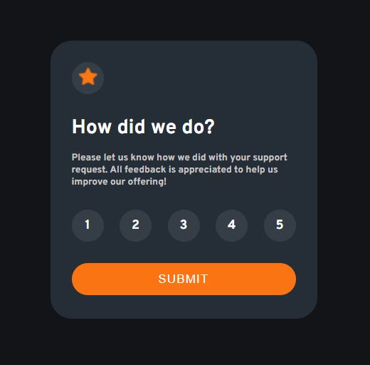

# Interactive Rating Component

This project is a simple interactive rating component created as a solution to the "Interactive Rating Component" challenge on [Frontend Mentor](https://www.frontendmentor.io/challenges/interactive-rating-component-koxpeBUmI).

 


You can view the live demo of this project here: [Interactive Rating Component](https://mehwishjbe.github.io/rating-component/).

## Table of Contents

- [Description](#description)
- [Features](#features)
- [Usage](#usage)

## Description

This interactive rating component allows users to rate their experience with a service or product by clicking on a set of stars. It provides a simple and visually appealing way for users to give their feedback.

The project is built using HTML, CSS, and JavaScript.

## Features

- Interactive star rating system.
- Submission of user ratings.
- A thank you message after rating submission.

## Project Structure

The project structure is simple and includes the following files and directories:

- `index.html`: The main HTML file for the result summary page.
- `style.css`: The CSS stylesheet for styling the page.
- `main.js/`: This directory contains the JavaScript file, main.js, which contains the code responsible for handling user interactions, like rating submissions and displaying the thank you message.
- `images/`: A directory containing image assets used in the project.

## Usage

1. Clone the repository to your local machine:

   ```bash
   git clone https://github.com/mehwishjbe/rating-component.git
